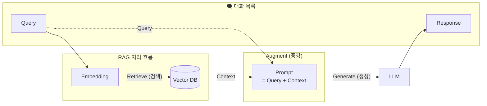

# Chapter 10 문서 검색 기반 답변, RAG

## RAG 이해하기

LLM과 같은 생성형 AI 모델은 사전 학습된 데이터에 기반해 동작하기 때문에, 학습 이후의 정보에 대해서는 정확한 답변을 할 수 없습니다.

또한 특화된 도메인이나 기업의 내부 지식으로 훈련되어 있지 않기 때문에, 이런 주제에 대해서는 AI 모델의 응답을 받기 힘듭니다.

이와 같은 문제점을 해결하기 위해 파인 튜닝, 검색 증강 생성, 도구 호출 등의 기술을 사용할 수 있습니다.

### 파인 튜닝

기존 모델을 추가 학습시키는 방법입니다. 고성능 GPU가 필요하고, 훈련에 필요한 많은 양의 데이터와 훈련 시간이 필요합니다. 하지만 응답의 일관성, 추론 지연 감소, 적은 토큰량, 보안에 유리, 운영 및 배포의 단순성과 같은 장점도 있습니다.

### 검색 증강 생성(RAG)



RAG는 사용자의 질문에 대한 해답을 얻기 위해 지식 기반 저장소(벡터 저장소)에서 우선 검색을 합니다.

검색결과를 프롬프트 내에 문맥(context)으로 추가해서 프롬프트를 증강합니다. 그리고 LLM은 자신의 지식과 프롬프트 내에 증강(Augment)된 내용을 참고해서 사용자의 질문에 맞는 자연스러운 응답을 생성합니다.

## 지식 기반 저장소와 ETL

RAG에서 말하는 지식 기반 저장소는 임베딩된 문서 조각들(Documents)을 저장하고 유사도 검색을 수행하는 벡터 저장소를 가리킵니다. 여기서 문서 조각이란, 원본 문서의 전체 토큰 양이 너무 크기 때문에 원본 문서를 작게 분할한 것을 말합니다.

Spring AI는 외부 소스로부터 텍스트를 추출(Extract)하고, Document로 변환(Transform)하고, 벡터 저장소에 적재(Load)하는 일련의 과정을 ETL파이프라인이라고 부릅니다.

DocumentReader는 소스로부터 텍스트를 추출하고, Document를 생성하는 역할을 합니다. 여기서 소스란 PDF, Word와 같은 로컬 파일이거나, 네트워크를 통해 읽은 데이터 등이 될 수 있습니다.

DocumentTransformer는 생성된 Document를 작게 분할하거나, 키워드, 요약 정보를 추가하는 역할을 합니다. 작게 분할하고, 키워드와 요약 정보를 추가하는 이유는 벡터 저장소의 검색 효율을 높이기 위함입니다. 작게 분할하는 이유는 검색된 Document로 프롬프트를 증강할 때, 프롬프트의 전체 토큰 양을 줄이기 위함입니다. 이렇게 작게 분할한 것을 청크(chunk)라고 합니다.

DocumentWriter는 이렇게 작게 분할된 청크 Document를 벡터 저장소에 저장(적재)합니다.

### DocumentReader

소스로부터 텍스트를 추출하고 Document를 생성

소스는 Resource 객체로 포장되어서 DocuemntReader의 입력으로 사용됩니다. Spring은 다양한 소스로부터 텍스트를 읽기 위해 Resource 인터페이스와 구현 클래스 제공

```java
Resource resource = new FileSystemResource("C:/data/sample.pdf");

Resource resource = new ClassPathResource("data/sample.pdf");

Resource resource = new URLResource("http://example.com/data/sample.html");

InputStream inputStream = ...;
Resource resource = new InputStreamResource(inputStream);

byte[] bytes = ...;
Resource resource = new ByteArrayResource(bytes);
```

MultipartFile 에서 파일 종류별로 읽는 DocumentReader 예시

```java
private List<Document> extract(MultipartFile attach) throws IOException {
	Resource resource = new ByteArrayResource(attach.getBytes());
	List<Document> documents = null;
	if(attach.getContentType().equals("text/plain")) {
		DocumentReader reader = new TextReader(resource);
		documents = reader.read();
	} else if (attach.getContentType().equals("application/pdf")) {
		DocumentReader reader = new PagePdfDocumentReader(resource);
		documents = reader.read();
	} else if (attach.getContentType().contains("wordprocessingml")) {
		DocumentReader reader = new TikaDocumentReader(resource);
		documents = reader.read();
	}
	return documents;
}
```

### DocumentTransformer: 분할하기

텍스트 임베딩 모델은 한 번에 입력할 수 있는 텍스트 양(토큰 수)이 제한되어 있습니다.

DocumentReader는 읽은 전체 텍스트를 1개의 Document로 생성할 수 있기 때문에 최대 토큰 수 보다 더 클 수 있습니다. 따라서 작은 사이즈로 분할할 필요가 있습니다.

벡터 저장소에서 유사도 검색 결과로 10개의 Document를 얻었다고 가정해보겠습니다. Document별로 최대 토큰 수를 가지고 있다면, 프롬프트에는 최대 토큰 수의 10배가 되기 때문에 작은 사이즈로 분할이 반드시 필요합니다. 또한 LLM에도 입력할 수 있는 최대 토큰 수(컨텍스트 윈도우)도 제한이 있습니다.

Document를 분할할 때 주의할 점은 콘텐츠 내용을 해치지 않는 선에서 청크 크기를 결정해야 합니다. 청크 크기를 너무 작게 잡으면 Document 콘텐츠 내용이 무엇인지 잘 모를 수 있습니다.

TokenTextSplitter는 Document를 작은 크기의 Document로 변환하는 Document Transformer입니다. 여기서 작은 크기는 청크 크기를 말합니다.

```java
public class TokenTextSplitter extends TextSplitter {

	private static final int DEFAULT_CHUNK_SIZE = 800;

	private static final int MIN_CHUNK_SIZE_CHARS = 350;

	private static final int MIN_CHUNK_LENGTH_TO_EMBED = 5;

	private static final int MAX_NUM_CHUNKS = 10000;
}
```

```java
DocumentTransformer transformer = new TokenTextSplitter();
// DocumentTransformer transformer = new TokenTextSplitter(500, 200, 5, 1000, false);
List<Document> transformeredDocuments = transformer.apply(documents);
```

- DocumentReader가 반환한 원본 Document 목록을 토큰 단위로 분할된 청크 Document 목록으로 변환
- 생성자를 통해 설정값을 지정할 수 있다.

### DocumentTransformer: 키워드 추가하기

Document는 텍스트 콘텐츠 외에 메타데이터를 가질 수 있습니다. 메타데이터가 있다면 필터링을 통해 검색 효율을 높여줄 수 있습니다. 메타데이터를 필터링하면 벡터 유사도 연산 대상이 줄어들기 때문에 응답 속도가 개선될 수 있습니다.

Spring AI는 Document 콘텐츠에서 키워드를 뽑아 메타데이터로 추가하는 DocumentTransformer 구현 클래스인 KeywordMetadataEnricher를 제공합니다. 이 클래스는 LLM을 사용하여 Document 텍스트 콘테츠로부터 키워드를 추출하고, 쉼표로 구분해서 “excerpt_keywords”키로 메타데이터에 추가합니다.

```java
DocumentTransformer transformer = new KeywordMetadataEnricher(chatModel, 5);
List<Document> transformeredDocuments = transformer.apply(documents); 
```

- KeywordMetadataEnricher 첫 번 째 매개값으로 LLM 호출을 위한 ChatModel, 두 번째 매개값으로는 추출할 키워드의 개수를 전달
- 주의할 점은, apply() 메소드의 매개값으로는 반드시 TokenTextSplitter를 통해 청크로 분활된 Document 목록을 제공해야 합니다. 키워드를 추출하여 메타데이터로 추가한 이후에는 문서를 다시 나눌 수 없기 때문입니다.

## ETL: Text, PDF, Word 파일

의존성 추가

```groovy
implementation 'org.springframework.ai:spring-ai-pdf-document-reader'
implementation 'org.springframework.ai:spring-ai-tika-document-reader'
```

```java
// ##### 필드 #####
private ChatModel chatModel;
private VectorStore vectorStore;

// ##### 생성자 #####
public ETLService(ChatModel chatModel, VectorStore vectorStore) {
  this.chatModel = chatModel;
  this.vectorStore = vectorStore;
}
```

- ChatModel과 VectorStore 주입

```java
// ##### 업로드된 파일을 가지고 ETL 과정을 처리하는 메소드 #####
public String etlFromFile(String title, String author,
    MultipartFile attach) throws IOException {

  // 추출하기
  List<Document> documents = extractFromFile(attach);
  if (documents == null) {
    return ".txt, .pdf, .doc, .docx 파일 중에 하나를 올려주세요.";
  }
  log.info("추출된 Document 수: {} 개", documents.size());

  // 메타데이터에 공통 정보 추가하기
  for (Document doc : documents) {
    Map<String, Object> metadata = doc.getMetadata();
    metadata.putAll(Map.of(
        "title", title,
        "author", author,
        "source", attach.getOriginalFilename()));
  }

  // 변환하기
  documents = transform(documents);
  log.info("변환된 Document 수: {} 개", documents.size());

  // 적재하기
  vectorStore.add(documents);

  return "올린 문서를 추출-변환-적재 완료 했습니다.";
}
```

- 추출 → 메타데이터 추가 → 변환 → 적재

추출

```java
// ##### 업로드된 파일로부터 텍스트를 추출하는 메소드 #####
private List<Document> extractFromFile(MultipartFile attach) throws IOException {
  // 바이트 배열을 Resource로 생성
  Resource resource = new ByteArrayResource(attach.getBytes());

  List<Document> documents = null;
  if (attach.getContentType().equals("text/plain")) {
    // Text(.txt) 파일일 경우
    DocumentReader reader = new TextReader(resource);
    documents = reader.read();
  } else if (attach.getContentType().equals("application/pdf")) {
    // PDF(.pdf) 파일일 경우
    DocumentReader reader = new PagePdfDocumentReader(resource);
    documents = reader.read();
  } else if (attach.getContentType().contains("wordprocessingml")) {
    // Word(.doc, .docx) 파일일 경우
    DocumentReader reader = new TikaDocumentReader(resource);
    documents = reader.read();
  }

  return documents;
}
```

변환(분할) 및 키워드 추가

```java
// ##### 작은 크기로 분할하고 키워드 메타데이터를 추가하는 메소드 #####
private List<Document> transform(List<Document> documents) {
  List<Document> transformedDocuments = null;

  // 작게 분할하기
  TokenTextSplitter tokenTextSplitter = new TokenTextSplitter();
  transformedDocuments = tokenTextSplitter.apply(documents);

  // 메타데이터에 키워드 추가하기
   KeywordMetadataEnricher keywordMetadataEnricher = 
       new KeywordMetadataEnricher(chatModel, 5);
   transformedDocuments = keywordMetadataEnricher.apply(transformedDocuments);

  return transformedDocuments;
}
```

## ETL: HTML, JSON

의존성 추가

```groovy
implementation 'org.springframework.ai:spring-ai-jsoup-document-reader'
```

### HTML ETL

```java
// ##### HTML의 ETL 과정을 처리하는 메소드 #####
public String etlFromHtml(String title, String author, String url) throws Exception {
  // URL로부터 Resource 얻기
  Resource resource = new UrlResource(url);

  // E: 추출하기
  JsoupDocumentReader reader = new JsoupDocumentReader(
      resource,
      JsoupDocumentReaderConfig.builder()
          .charset("UTF-8")
          .selector("#content")
          .additionalMetadata(Map.of(
              "title", title,
              "author", author,
              "url", url))
          .build());
  List<Document> documents = reader.read();
  log.info("추출된 Document 수: {} 개", documents.size());

  // T: 변환하기
  DocumentTransformer transformer = new TokenTextSplitter();
  List<Document> transformedDocuments = transformer.apply(documents);
  log.info("변환된 Document 수: {} 개", transformedDocuments.size());

  // L: 적재하기
  vectorStore.add(transformedDocuments);

  return "HTML에서 추출-변환-적재 완료 했습니다.";
}
```

- URL로부터 Resource 객체 생성
- JsoupDocumentReaderConfig는 문자 인코딩 정보와 CSS 선택자를 사용해서 읽을 텍스트가 존재하는 위치를 알려주는 역할
- HTML은 페이지 구분이 불가능해서 List<Document>에 한 개의 Document만 저장됩니다. 따라서 TokenTextSplitter를 이용해서 작은 크기로 분할 필요

### JSON ETL

JsonReader는 Spring AI가 기본적으로 지원

```java
// ##### JSON의 ETL 과정을 처리하는 메소드 #####
public String etlFromJson(String url) throws Exception {
  // URL로부터 Resource 얻기
  Resource resource = new UrlResource(url);

  // E: 추출하기
  JsonReader reader = new JsonReader(
      resource,
      new JsonMetadataGenerator() {
        @Override
        public Map<String, Object> generate(Map<String, Object> jsonMap) {
          return Map.of(
              "title", jsonMap.get("title"),
              "author", jsonMap.get("author"),
              "url", url);
        }
      },
      "date", "content");
  List<Document> documents = reader.read();
  log.info("추출된 Document 수: {} 개", documents.size());

  // T: 변환하기
  DocumentTransformer transformer = new TokenTextSplitter();
  List<Document> transformedDocuments = transformer.apply(documents);
  log.info("변환된 Document 수: {} 개", transformedDocuments.size());

  // L: 적재하기
  vectorStore.add(transformedDocuments);

  return "JSON에서 추출-변환-적재 완료 했습니다.";
}
```

- JsonReader는 JSON으로부터 텍스트 추출
- JsonMetadataGenerator는 메타데이터를 생성하는 역할

## RAG: QuestionAnswerAdvisor

vectorStore 의존성

```groovy
implementation 'org.springframework.ai:spring-ai-advisors-vector-store' 
```

```java
// ##### 필드 #####
private ChatClient chatClient;
@Autowired private VectorStore vectorStore;
@Autowired private JdbcTemplate jdbcTemplate;

// ##### 생성자 #####
public RagService1(ChatClient.Builder chatClientBuilder) {
  this.chatClient = chatClientBuilder
      .defaultAdvisors(
          new SimpleLoggerAdvisor(Ordered.LOWEST_PRECEDENCE - 1)
      )
      .build();
}
```

```java
// ##### 벡터 저장소의 데이터를 모두 삭제하는 메소드 #####
public void clearVectorStore() {
  jdbcTemplate.update("TRUNCATE TABLE vector_store");
}
```

- 벡터 저장소의 vector_store 테이블 내용을 모두 비웁니다.

```java
// ##### PDF 파일을 ETL 처리하는 메소드 #####
public void ragEtl(MultipartFile attach, String source, int chunkSize, int minChunkSizeChars) throws IOException {
  // 추출하기
  Resource resource = new ByteArrayResource(attach.getBytes());
  DocumentReader reader = new PagePdfDocumentReader(resource);
  List<Document> documents = reader.read();

  // 메타데이터 추가
  for (Document doc : documents) {
    doc.getMetadata().put("source", source);
  }

  // 변환하기
  DocumentTransformer transformer = new TokenTextSplitter(
      chunkSize, minChunkSizeChars, 5, 10000, true);
  List<Document> transformedDocuments = transformer.apply(documents);

  // 적재하기
  vectorStore.add(transformedDocuments);
}
```

- MultipartFile로 부터 Reousrce 객체를 생성한 후, PagePdfDocumentReader를 초기화합니다. 그다음 PDF 파일로부터 텍스트를 추출
- TokenTextSplitter에 임시 청크 사이즈와 확정 청크의 최소 문자 수를 반영
    - 청크 크기는 벡터 저장소 유사도 검색에 큰 영향을 미치기 때문에 원본 PDF 내용에 따라서 어떤 값으로 설정해야 검색이 잘 되는지 충분한 테스트를 거쳐 적정 값을 얻어야 합니다.

```java
// ##### LLM과 대화하는 메소드 #####
public String ragChat(String question, double score, String source) {
  // 벡터 저장소 검색 조건 생성
  SearchRequest.Builder searchRequestBuilder = SearchRequest.builder()
      .similarityThreshold(score)
      .topK(3);
  if (StringUtils.hasText(source)) {
	  // 메타데이터에서 해당 출처(source)로 필터링
    searchRequestBuilder.filterExpression("source == '%s'".formatted(source));
  }
  SearchRequest searchRequest = searchRequestBuilder.build();

  // QuestionAnswerAdvisor 생성
  QuestionAnswerAdvisor questionAnswerAdvisor = QuestionAnswerAdvisor.builder(vectorStore)
      .searchRequest(searchRequest)
      .build();

  // 프롬프트를 LLM으로 전송하고 응답을 받는 코드
  String answer = this.chatClient.prompt()
      .user(question)
      .advisors(questionAnswerAdvisor)
      .call()
      .content();
  return answer;
}
```

- 검색 시 공통으로 적용되는 조건입니다. similarityThreshold() 메소드를 사용하여 유사도 임계점수를 설정합니다. 이 값은 0.0 ~ 1.0 사이의 실수로 지정하며, 설정된 임계점수 이상으로 유사한 Document만 검색 대상에 포함됩니다.
- 소스 정보가 제공될 경우 메타데이터에서 해당 출처로 필터링해서 유사도 검색을 수행합니다.
- 검색 조건 객체인 SearchRequest 생성
- RAG 처리를 담당하는 QuestionAnswerAdvisor를 생성. SearchRequest에 정의된 검색 조건을 사용하여 벡터 저장소에서 관련 문서를 검색하고 검색 결과를 프롬프트에 포함시키는 역할을 합니다.

검색된 Document의 유사도 점수는 임시 청크 크기(chunkSize)와 최소 청크 크기(minChunkSizeChars)에 따라서 달라집니다. 청크 크기가 클수록, 대체로 유사도는 낮게 나옵니다. 반대로 너무 작게 주면 사용자 질문을 온전히 포함한 Document가 없을 수 있습니다.

## RAG: RetrievalAugmentationAdivsor

RAG용 Advisor로는 QuestionAnswerAdvisor 외에도 RetrievalAugmentationAdivsor가 있습니다. 이 Advisor는 검색, 증강, 생성의 세 단계를 모듈화한 구조로 설계되었습니다.

각 단계를 독립적인 구성요소로 나누어, 런타임 시점에 필요한 모듈을 조합하여 유연하게 사용할 수 있도록 되어 있습니다.

RetrievalAugmentationAdivso에 추가되는 모듈은 사용 시점에 따라 네 종류로 구분합니다.

- 검색 전 모듈 : 유사도 검색 전에 실행하는 모듈
- 검색 모듈 : 유사도 검색 시 사용하는 모듈
- 검색 후 모듈 : 유사도 검색 후에 실행하는 모듈
- 생성 모듈 : LLM으로 보내기 직전에 실행하는 모듈

Spring AI가 지원하는 검색 전 모듈

- 압축 쿼리 변환기 : CompressionQueryTransformer
- 쿼리 재작성 변환기 : RewriteQueryTransformer
- 번역 쿼리 변환기 : TranslationQueryTransformer
- 쿼리 확장 : MultiQueryExpander

의존성 설정

```groovy
implementation 'org.springframework.ai:spring-ai-rag'
```

- RetrievalAugmentationAdivso와 관련 있는 클래스를 사용하려면 위 의존성 필요

## RAG: CompressionQueryTransformer 모듈

유사도 검색을 수행하기 전에 실행되는 검색 전 모듈입니다. 이전 대화와 관련이 있는 모호한 사용자의 질문을 LLM을 활용하여 명확하고 완전한 질문으로 변환합니다. 이렇게 변환된 질문은 임베딩 과정을 거쳐 벡터 저장소 유사도 검색에 사용됩니다.

예를 들어, 사용자 질문이 “국회의원은?” 이라면, 무엇을 알려달라고 하는지 모호합니다. 하지만 이전 대화 기억에 “대통령의 임기는 몇 년입니까?”가 있을 경우, 사용자가 국회의원의 임기를 물어보고 있다는 것을 알 수 있습니다. 그래서 사용자의 질문을 다음과 같이 명확하고 완전한 질문으로 변환할 필요가 있습니다.

```groovy
"국회의원은?" -> "국회의원의 임기는 몇 년입니까?"
```

CompressionQueryTransformer가 LLM에게 완전한 질문 변환을 요청하려면 이전 대화 내용이 프롬프트에 포함되어 있어야 합니다. LLM이 이전 대화 내용을 모른다면 완전한 질문으로 변환할 수 없기 때문입니다. 따라서 CompressionQueryTransformer가 실행되기 전에 대화 내용을 프롬프트에 추가하는 Advisor가 먼저 실행되어야 합니다.

CompressionQueryTransformer는 MessageChatMemoryAdvisor와 함께 사용 가능합니다.

```java
// ##### 필드 #####
private ChatClient chatClient;
@Autowired
private ChatModel chatModel;
@Autowired
private VectorStore vectorStore;
@Autowired
private ChatMemory chatMemory;

// ##### 생성자 #####
public RagService2(ChatClient.Builder chatClientBuilder) {
  this.chatClient = chatClientBuilder
    .defaultAdvisors(
        new SimpleLoggerAdvisor(Ordered.LOWEST_PRECEDENCE - 1)
    )
    .build();
}
```

- 의존성 주입

```java
// ##### CompressionQueryTransformer를 생성하고 반환하는 메소드 #####
private CompressionQueryTransformer createCompressionQueryTransformer() {
  // 새로운 ChatClient를 생성하는 빌더 생성
  ChatClient.Builder chatClientBuilder = ChatClient.builder(chatModel)
      .defaultAdvisors(
          new SimpleLoggerAdvisor(Ordered.LOWEST_PRECEDENCE - 1)    
      );

  // 압축 쿼리 변환기 생성
  CompressionQueryTransformer compressionQueryTransformer = 
      CompressionQueryTransformer.builder()
          .chatClientBuilder(chatClientBuilder)
          .build();

  return compressionQueryTransformer;
}
```

- 사용자 질문을 완전한 질문으로 만들기 위해서는 원래 사용자 질문을 위한 ChatClient와는 별도로 새로운 ChatClient를 사용해야 합니다. 따라서 새로운 ChatClient.Builder가 필요합니다.

```java
// ##### VectorStoreDocumentRetriever 생성하고 반환하는 메소드 #####
private VectorStoreDocumentRetriever createVectorStoreDocumentRetriever(
  double score, String source) {
    VectorStoreDocumentRetriever vectorStoreDocumentRetriever =
            VectorStoreDocumentRetriever.builder()
                    .vectorStore(vectorStore)
                    .similarityThreshold(score)
                    .topK(3)
                    .filterExpression(() -> {
                        FilterExpressionBuilder builder = new FilterExpressionBuilder();
                        if (StringUtils.hasText(source)) {
                            return builder.eq("source", source).build();
                        } else {
                            return null;
                        }
                    })
                    .build();
    return vectorStoreDocumentRetriever;
}
```

- 유사도 검색을 수행하기 위한 벡터 저장소와 유사도 임계점수 이상의 상위 3개만 가져오도록 설정
- 메타데이터 필터링을 위한 코드

```java
// ##### LLM과 대화하는 메소드 #####
public String chatWithCompression(String question, double score, String source, String conversationId) {
  // RetrievalAugmentationAdvisor 생성
  RetrievalAugmentationAdvisor retrievalAugmentationAdvisor = 
      RetrievalAugmentationAdvisor.builder()
          .queryTransformers(createCompressionQueryTransformer())
          .documentRetriever(createVectorStoreDocumentRetriever(score, source))
          .build();

  // 프롬프트를 LLM으로 전송하고 응답을 받는 코드
  String answer = this.chatClient.prompt()
      .user(question)
      .advisors(
        MessageChatMemoryAdvisor.builder(chatMemory).build(), 
        retrievalAugmentationAdvisor
      )
      .advisors(advisorSpec -> advisorSpec.param(
          ChatMemory.CONVERSATION_ID, conversationId))
      .call()
      .content();
  return answer;
}
```

- 질문 변환 모듈을 추가하는 queryTransformers() 메소드로 CompressionQueryTransformer 모듈을 추가합니다. 그리고 검색 모듈을 추가하는 documentRetriever() 메소드로 VectorStoreDocumentRetriever를 추가합니다.
- 대화 기록을 프롬프트에 추가하는 MessageChatMemoryAdvisor와 완성된 RetrievalAugmentationAdvisor를 ChatClient의 Advisor에 추가합니다.
- MessageChatMemoryAdvisor에서 사용할 대화 ID를 Advisor 공유 데이터에 추가합니다.

**실행 흐름 요약:**

`chatMemory` → `MessageChatMemoryAdvisor` (대화 기록을 프롬프트에 주입) → `CompressionQueryTransformer` (기록 + 질문 → 독립 쿼리로 압축) → `VectorStoreDocumentRetriever` (압축된 쿼리로 유사도 검색) → LLM 호출

## RAG: RewriteQueryTransformer 모듈

유사도 검색을 수행하기 전에 실행되는 검색 전 모듈입니다. 사용자 질문이 장황하고, 검색 결과의 품질에 영향을 줄 수 있는 불필요한 정보가 포함되어 있을 경우, LLM을 활용하여 질문을 재작성합니다. 이렇게 재작성된 질문은 벡터 저장소 유사성 검색에 더 나은 결과를 얻도록 도와줍니다.

```java
// ##### RewriteQueryTransformer 생성하고 반환하는 메소드 #####
private RewriteQueryTransformer createRewriteQueryTransformer() {
  // 새로운 ChatClient 생성하는 빌더 생성
  ChatClient.Builder chatClientBuilder = ChatClient.builder(chatModel)
      .defaultAdvisors(
          new SimpleLoggerAdvisor(Ordered.LOWEST_PRECEDENCE - 1)    
      );

  // 질문 재작성기 생성
  RewriteQueryTransformer rewriteQueryTransformer = 
      RewriteQueryTransformer.builder()
          .chatClientBuilder(chatClientBuilder)
          .build();

  return rewriteQueryTransformer;
}
```

- 사용자 질문을 재작성하기 위해서는 원래 사용자 질문을 위한 ChatClient와는 별도로 새로운 ChatClient를 사용해야 합니다. 따라서 새로운 ChatClient.Builder가 필요합니다.

```java
public String chatWithRewriteQuery(String question, double score, String source) {
  // RetrievalAugmentationAdvisor 생성
  RetrievalAugmentationAdvisor retrievalAugmentationAdvisor = 
      RetrievalAugmentationAdvisor.builder()
          .queryTransformers(createRewriteQueryTransformer())
          .documentRetriever(createVectorStoreDocumentRetriever(score, source))
          .build();

  // 프롬프트를 LLM으로 전송하고 응답을 받는 코드
  String answer = this.chatClient.prompt()
      .user(question)
      .advisors(retrievalAugmentationAdvisor)
      .call()
      .content();
  return answer;
}  
```

- 질문 변환 모듈을 추가하는 queryTransformers() 메소드로 RewriteQueryTransformer 모듈을 추가합니다. 그리고 검색 모듈을 추가하는 documentRetriever() 메소드로 VectorStoreDocumentRetriever를 추가합니다.
- 완성된 RetrievalAugmentationAdvisor를 ChatClient에 추가합니다.

## RAG: TranslationQueryTransformer 모듈

유사도 검색을 수행하기 전에 실행되는 검색 전 모듈입니다. LLM을 활용하여 사용자 질문을 임베딩 모델이 지원하는 대상 언어로 번역합니다. 사용자 질문이 이미 대상 언어로 되어 있거나 언어를 알 수 없는 경우에는 번역되지 않습니다.

만약 영어 문장으로만 학습된 임베딩 모델을 사용할 경우에는 사용자의 질문도 영어로 변환해서 임베딩을 수행해야합니다.

```java
// ##### TranslationQueryTransformer 생성하고 반환하는 메소드 #####
private TranslationQueryTransformer createTranslationQueryTransformer() {
  // 새로운 ChatClient를 생성하는 빌더 생성
  ChatClient.Builder chatClientBuilder = ChatClient.builder(chatModel)
      .defaultAdvisors(
          new SimpleLoggerAdvisor(Ordered.LOWEST_PRECEDENCE - 1)
      );

  // 질문 번역기 생성
  TranslationQueryTransformer translationQueryTransformer = 
      TranslationQueryTransformer.builder()
          .chatClientBuilder(chatClientBuilder)
          .targetLanguage("korean")
          .build();

  return translationQueryTransformer;
}
```

- 사용자 질문을 번역하기 위해서는 원래 사용자 질문을 위한 ChatClient와는 별도로 새로운 ChatClient를 사용해야 합니다. 따라서 새로운 ChatClient.Builder가 필요합니다.
- 번역 대상 언어가 한국어인 TranslationQueryTransformer를 생성합니다.

```java
// ##### LLM과 대화하는 메소드 #####
public String chatWithTranslation(String question, double score, String source) {
  // RetrievalAugmentationAdvisor 생성
  RetrievalAugmentationAdvisor retrievalAugmentationAdvisor = 
      RetrievalAugmentationAdvisor.builder()
          .queryTransformers(createTranslationQueryTransformer())
          .documentRetriever(createVectorStoreDocumentRetriever(score, source))
          .build();

  // 프롬프트를 LLM으로 전송하고 응답을 받는 코드
  String answer = this.chatClient.prompt()
      .user(question)
      .advisors(retrievalAugmentationAdvisor)
      .call()
      .content();
  return answer;
}
```

- 질문 변환 모듈을 추가하는 queryTransformers() 메소드로 TranslationQueryTransformer 모듈을 추가합니다. 그리고 검색 모듈을 추가하는 documentRetriever() 메소드로 VectorStoreDocumentRetriever를 추가합니다.
- 완성된 RetrievalAugmentationAdvisor를 ChatClient에 추가합니다.

OpenAI 임베딩 모델을 사용할 경우 TranslationQueryTransformer를 사용하지 않아도 다양한 언어로 질문하더라도 올바른 답변이 출력됩니다.

## RAG: MultiQueryExpander 모듈

유사도 검색을 수행하기 전에 실행되는 검색 전 모듈입니다. 사용자의 질문을 LLM을 활용하여 다양한 확장 질문들로 생성합니다. 확장된 질문들은 개별적으로 벡터 저장소 유사도 검색에 사용되며, 검색된 Document는 자동으로 합쳐집니다.

MultiQueryExpander를 사용하면 사용자의 질문을 여러 관점에서 보게 되고, 벡터 유사도 검색 시 질문에 맞는 결과를 찾을 가능성을 높여줍니다.

```java
// ##### MultiQueryExpander 생성하고 반환하는 메소드 #####
private MultiQueryExpander createMultiQueryExpander() {
  // 새로운 ChatClient 빌더 생성
  ChatClient.Builder chatClientBuilder = ChatClient.builder(chatModel)
      .defaultAdvisors(
          new SimpleLoggerAdvisor(Ordered.LOWEST_PRECEDENCE - 1)
      );

  // 질문 확장기 생성
  MultiQueryExpander multiQueryExpander = 
      MultiQueryExpander.builder()
          .chatClientBuilder(chatClientBuilder)
          .includeOriginal(true)
          .numberOfQueries(3)
          .build();

  return multiQueryExpander;
}
```

- 사용자 질문을 번역하기 위해서는 원래 사용자 질문을 위한 ChatClient와는 별도로 새로운 ChatClient를 사용해야 합니다. 따라서 새로운 ChatClient.Builder가 필요합니다.
- MultiQueryExpander에는 원본 질문도 포함시키고, 추가적으로 3개의 확장된 질문을 만듭니다. 그럼 총 4개의 질문이 유사도 검색에 참여합니다.

```java
// ##### LLM과 대화하는 메소드 #####
public String chatWithMultiQuery(String question, double score, String source) {
  // RetrievalAugmentationAdvisor 생성
  RetrievalAugmentationAdvisor retrievalAugmentationAdvisor = 
      RetrievalAugmentationAdvisor.builder()
          .queryExpander(createMultiQueryExpander())
          .documentRetriever(createVectorStoreDocumentRetriever(score, source))
          .build();

  // 프롬프트를 LLM으로 전송하고 응답을 받는 코드
  String answer = this.chatClient.prompt()
      .user(question)
      .advisors(retrievalAugmentationAdvisor)
      .call()
      .content();
  return answer;
}
```

- 질문 확장 모듈을 추가하는 queryExpander() 메소드로 MultiQueryExpander를 추가합니다. 그리고 검색 모듈을 추가하는 documentRetriever() 메소드로 VectorStoreDocumentRetriever를 추가합니다.
- 완성된 RetrievalAugmentationAdvisor를 ChatClient에 추가합니다.