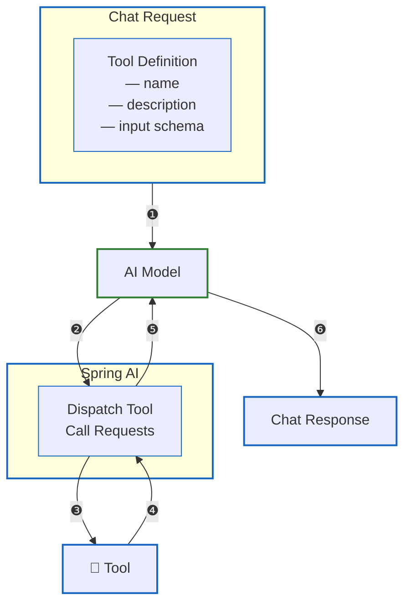

# Chapter 11 도구 호출

## 도구 호출 (Tool Calling)

도구 호출은 함수 호출이라고도 불립니다. 도구 호출은 LLM이 애플리케이션 내부 또는 외부의 API와 상호작용함으로써 기능을 확장할 수 있도록 해주는 기술입니다.

애플리케이션이 보유한 도구 목록을 LLM에게 노출하면, LLM은 필요에 따라 이 도구들을 호출할 수 있습니다. LLM이 도구를 호출하는 주요 목적은 모델이 사전에 학습하지 못한 정보를 실시간으로 조회하거나, 외부 조치를 자동으로 실행하기 위해서입니다.

### 정보 조회

도구 호출을 통해 LLM은 데이터베이스, 웹 검색 엔진, 파일 시스템 등에서 정보를 검색할 수 있습니다. 이를 통해 LLM은 사전 학습된 지식에 의존하지 않고도 최신 정보나 사용자 맞춤형 데이터를 실시간으로 확인할 수 있기 때문에 스스로 답할 수 없는 질문에 대해서도 적절한 응답을 생성할 수 있게 됩니다.

### 조치 취하기

일반적으로 도구 호출은 LLM의 확장 기능으로 설명되지만, 실제로 도구를 호출하고 실행하는 주체는 애플리케이션입니다. LLM은 특정 작업을 수행하기 위해 도구 호출을 요청하고, 필요한 매개변수만 제공합니다. 이 요청을 받은 애플리케이션은 해당 메소드를 직접 실행하고, 그 결과를 다시 LLM에게 전달합니다. 따라서 실행 제어와 보안 관리의 책임은 애플리케이션에 있게 됩니다.



- ❶ Spring AI는 도구 정의를 프롬프트에 포함해서 LLM으로 전송합니다. 도구 정의는 이름, 설명, 입력 스키마 등으로 구성됩니다.
- ❷ LLM이 도구의 설명을 검토한 후 호출하기로 결정하면, 도구 이름과 입력 매개값을 포함한 응답을 Spring AI로 보냅니다.
- ❸ Spring AI는 도구 이름과 입력 매개값을 받고, 도구를 호출해서 실행합니다.
- ❹❺ Spring AI는 도구 호출 결과를 다시 LLM으로 전송합니다.
- ❻ LLM은 도구 호출 결과를 받고, 최종 응답을 생성하고 Spring AI로 보냅니다.

## 도구 정의하기

```java
@Tool(description = "도구 설명...")
public String toolName(...){}
```

- 도구의 코드 형태는 메소드입니다. 메소드가 도구로서 사용되려면 @Tool 어노테이션을 적용해야합니다.
- @Tool을 적용할 수 있는 메소드는 정적이거나 인스턴스 메소드일 수 있으며, 접근 제한자는 public, protected, default, private 중 어느 것이든 가능합니다.
- 도구의 매개변수 타입은 기본 타입과 참조 타입을 모두 사용할 수 있습니다. 참조 타입에는 클래스, 인터페이스, 열거 타입, 배열, List, Map 등이 포함됩니다. 매개변수의 개수에는 제한이 없습니다. 반환 타입 역시 void를 포함하여 참조 타입을 사용할 수 있습니다.

도구의 매개변수와 반환 타입은 LLM에게 전달할 수 있도록 JSON으로 직렬화가 가능한 구죠여야합니다. 따라서 직렬화되지 않는 특수 타입은 사용할 수 없습니다.

### 매개변수 및 반환 타입으로 사용할 수 없는 예외적인 타입

- Optional
- 비동기 타입: CompletableFuture, Future
- 리액티브 타입; Flow, Mono, Flux
- 함수형 타입: Function, Supplier, Consumer

이러한 도구 메소드들을 제공하는 클래스는 최상위 클래스뿐만 아니라 중첩 클래스로도 정의할 수 있습니다. 또한, 해당 클래스는 단순한 POJO 형태로도 생성할 수도 있고, Spring Bean으로 등록하여 의존성 주입 등 Spring 의 기능을 활용할 수도 있습니다.

### @Tool 어노테이션

#### 속성

- name : 도구의 이름, 제공하지 않으면 메소드 이름이 사용됨, 도구 목록에서 도구 이름은 유일해야 함, LLM은 이 이름을 사용하여 도구를 호출 요청
- (필수) description : 어떤 경우에 호출하면 좋은지에 대해 설명, 설명이 부족하면 LLM은 도구 호출을 할 수 없음
- resultConverter : 도구 호출 결과는 문자열로 변환되어 LLM에게 전송, JSON으로 직렬화
- returnDirect : 도구 호출의 결과를 LLM에게 전송할 경우 false를 지정, 도구 호출의 결과를 클라이언트에게 직접 반환할 경우 true, default = false

### @ToolParam 어노테이션

매개변수에 직접 적용하여 설명이나 필수 여부 등의 추가 정보를 제공할 수 있습니다.

#### 속성

- (필수) description : LLM이 어떤 매개값을 제공해야 하는지 도움을 주는 설명을 작성
- required : 매개값 제공이 필수(true)인지 선택사항(false)인지를 지정, 제공하지 않으면 기본 값은 true

매개변수에 @Nullable 어노테이션이 적용되면 명시적으로 @ToolParam 어노테이션을 사용하여 필수로 표시하지 않는 한 선택적인 것으로 간주됩니다. 매개변수가 선택일 경우, LLM은 값을 제공하지 않고 도구를 호출할 수 있다는 의입니다.

## 프롬프트에 도구 정보 포함

LLM에게 전송되는 프롬프트에 도구 정보를 포함시키려면, ChatClient를 호출할 때 tools() 메소드를 통해 도구가 정의된 클래스의 인스턴스들을 전달하면 됩니다.

이때 전달된 인스턴스 내에서 @Tool 어노테이션이 적용된 메소드들에 대한 정의 정보가 자동으로 추출되어, 프롬프트에 포함됩니다.

```java
@Component
@Slf4j
public class DateTimeTools {
  @Tool(description = "현재 날짜와 시간 정보를 제공합니다.")
  public String getCurrentDateTime() {
    String nowTime = LocalDateTime.now()
            .atZone(LocaleContextHolder.getTimeZone().toZoneId())
            .toString();
    log.info("현재 시간: {}", nowTime);
    return nowTime;
  }

  @Tool(description = "지정된 시간에 알람을 설정합니다.")
  public void setAlarm(
      @ToolParam(description = "ISO-8601 형식의 시간", required = true) 
      String time) {
    /*
    LLM은 다음과 같은 값을 제공할 수 있습니다.
    2025-07-03T24:12:29+09:00 
    하지만 이 값은 유효하지 않은 ISO-8601 날짜/시간 포맷입니다.
    시간의 유효 범위를 0 ~ 23 으로 제한하기 때문에 24:12:29 는 파싱 불가능합니다.
    따라서 24:... 를 00:... 로 변환하면서 날짜를 다음 날로 증가시켜야 합니다.
    */    
    // "T24:" 패턴 처리
    if (time.contains("T24:")) {
      int tIndex = time.indexOf("T");
      String datePart = time.substring(0, tIndex);
      String timePart = time.substring(tIndex + 1);
      // 날짜 +1
      LocalDate date = LocalDate.parse(datePart);
      date = date.plusDays(1);
      // "24:" → "00:"으로 교체
      timePart = timePart.replaceFirst("24:", "00:");
      // 재조합
      time = date + "T" + timePart;
    }
    // 파싱 시도
    LocalDateTime alarmTime = LocalDateTime.parse(time, DateTimeFormatter.ISO_DATE_TIME);
    log.info("알람 설정 시간: " + alarmTime);
  } 
}
```

- @Tool 어노테이션 적용해서 도구로 정의합니다.
- @ToolParam(description = "ISO-8601 형식의 시간", required = true)를 적용해서 날짜와 시간 데이터를 교환하는 ISO-8601 형식을 지정했습니다.

```java
@Service
@Slf4j
public class DateTimeService {
  // ##### 필드 #####
  private ChatClient chatClient;

  @Autowired
  private DateTimeTools dateTimeTools;

  // ##### 생성자 #####
  public DateTimeService(ChatClient.Builder chatClientBuilder) {
    this.chatClient = chatClientBuilder
        .build();
  }

  // ##### LLM과 대화하는 메소드 #####
  public String chat(String question) {
    String answer = this.chatClient.prompt()
        .user(question)
        .tools(dateTimeTools)
        .call()
        .content();
    return answer;
  }
}
```

- DateTimeTools Bean을 주입
- ChatClient 호출할 때 tools() 메소드로 DateTimeTools을 제공

## 추가 데이터 제공

LLM이 도구 호출을 요청할 때 전달하는 매개값과는 별도로, Spring AI는 애플리케이션이 직접 관리하는 민감한 정보를 도구에 전달할 수 있도록 ToolContext 객체를 제공합니다.

ToolContext는 LLM이 접근해서는 안 되는 정보(인증 정보, 사용자 세션 등)를 안전하게 도구 메소드 내에서 활용할 수 있도록 해줍니다.

제공될 데이터가 질문할 때마다 변경된다면 toolContext()로, 그렇지 않다면 defaultToolContext()로 생성하는 것이 좋습니다.

```java
@Component
@Slf4j
public class HeatingSystemTools {

  @Tool(description = 
    """
      타겟 온도까지 난방 시스템을 가동합니다.
      난방 시스템 가동이 성공되었을 경우 success를 반환합니다.
      난방 시스템 가동이 실패되었을 경우 failure를 반환합니다.
    """
  )
  public String startHeatingSystem(
    @ToolParam(description = "타겟 온도", required = true) int targetTemperature,
    ToolContext toolContext) {
    String controlKey = (String) toolContext.getContext().get("controlKey");
    if(controlKey!=null && controlKey.equals("heatingSystemKey")) {
      log.info("{}도까지 난방 시스템을 가동합니다.", targetTemperature);
      return "success";
    } else {
      log.info("난방 시스템을 가동할 권한이 없습니다.");
      return "failure";
    }
  }
  // ... 
 }
```

- ToolContext를 주입받기 위해 매개변수 선언
- controlKey에 대한 값을 얻고, null인지 그리고 올바른 키인지 확인

```java
@Service
@Slf4j
public class HeatingSystemService {
  // ##### 필드 #####
  private ChatClient chatClient;

  @Autowired
  private HeatingSystemTools heatingSystemTools;

  // ##### 생성자 #####
  public HeatingSystemService(ChatModel chatModel) {
    this.chatClient = ChatClient.builder(chatModel).build();
  }

  // ##### LLM과 대화하는 메소드 #####
  public String chat(String question) {
    String answer = chatClient.prompt()
        .system("""
          현재 온도가 사용자가 원하는 온도 이상이라면 난방 시스템을 중지하세요.
          현재 온도가 사용자가 원하는 온도 이하라면 난방 시스템을 가동시켜주세요.
        """)
        .user(question)
        .tools(heatingSystemTools)
        .toolContext(Map.of("controlKey", "heatingSystemKey"))
        .call()
        .content();
    return answer;
  }
}
```

- 질문을 할 때마다 tools()로 HeatingSystemTools를 제공하고, 제어키 값을 toolContext() 메소드를 사용하여 ToolContext에 포함시켰습니다.

## 도구 예외 처리

도구 실행이 실패하면 ToolExecutionException 예외가 발생합니다. 이를 catch해서 예외를 처리할 수 있습니다. 예외 처리는 예외 메시지를 LLM으로 전달해서 LLM이 처리하도록 할 수 있고, 아니면 애플리케이션이 직접 처리할 수도 있습니다.

기본적으로 도구 실행 예외 처리는 DefaultToolExecutionExceptionProcessor가 합니다. 기본 처리 방식은 오류 메시지를 LLM으로 전달하고, LLM이 응답으로 오류 메시지를 애플리케이션으로 보내줍니다.

애플리케이션에서 직접 예외를 처리하고 싶다면 다음과 같이 ToolExecutionExceptionProcessor Bean을 생성하면 됩니다. DefaultToolExecutionExceptionProcessor 생성자의 매개값을 true로 주면, 오류 메시지를 LLM으로 전달하는 대신 예외가 애플리케이션으로 던져집니다.

```java
@Configuration
public class ExceptionHandlingConfig {
  //@Bean
  ToolExecutionExceptionProcessor toolExecutionExceptionProcessor() {
    return new DefaultToolExecutionExceptionProcessor(true);
  }
}
```

## 인터넷 검색 도구

실시간 정보를 다루는 애플리케이션을 구현한다면 LLM이 인터넷 검색 도구를 사용해서 신뢰할 수 있는 최신성을 갖춘 응답을 제공함으로써, 사용자의 질문에 더 유익한 정보를 제공할 수 있게 됩니다.

인터넷 검색 도구를 구현하려면 먼저 어떤 검색 서비스를 사용할지 결정하고, 해당 서비스의 인증 방식과 응답 형식을 파악해야합니다. 대표적인 검색 서비스의 종류는 다음과 같습니다.

- Bing Web Search API (Microsoft)
- Brave Search API (Brave Software)
- Google Custom Search API (Google)

```java
@Component
@Slf4j
public class InternetSearchTools {
  // ##### 필드 #####
  private String searchEndpoint;
  private String apiKey;
  private String engineId;
  private WebClient webClient;
  private ObjectMapper objectMapper = new ObjectMapper();

  // ##### 생성자 #####
  public InternetSearchTools(
      @Value("${google.search.endpoint}") String endpoint,      
      @Value("${google.search.apiKey}") String apiKey,      
      @Value("${google.search.engineId}") String engineId,
      WebClient.Builder webClientBuilder
  ) {
    this.searchEndpoint = endpoint;
    this.apiKey = apiKey;
    this.engineId = engineId;
    this.webClient = webClientBuilder
        .baseUrl(searchEndpoint)
        .defaultHeader("Accept", "application/json")
        .build();
  }

  // ##### 도구 #####
  @Tool(description = "인터넷 검색을 합니다. 제목, 링크, 요약을 문자열로 반환합니다.")
  public String googleSearch(String query) {
    try {
      String responseBody = webClient.get()
          .uri(uriBuilder -> uriBuilder
              .queryParam("key", apiKey)
              .queryParam("cx", engineId)
              .queryParam("q", query)
              .build())
          .retrieve()
          .bodyToMono(String.class)
          .block();
      //log.info("응답본문: {}", responseBody);

      JsonNode root = objectMapper.readTree(responseBody);
      JsonNode items = root.path("items");

      if (!items.isArray() || items.isEmpty()) {
        return "검색 결과가 없습니다.";
      }

      StringBuilder sb = new StringBuilder();
      for (int i = 0; i < Math.min(3, items.size()); i++) {
        JsonNode item = items.get(i);
        String title = item.path("title").asText();
        String link = item.path("link").asText();
        String snippet = item.path("snippet").asText();
        sb.append(String.format("[%d] %s\n%s\n%s\n\n", i + 1, title, link, snippet));
      }
      return sb.toString().trim();

    } catch (Exception e) {
      return "인터넷 검색 중 오류 발생: " + e.getMessage();
    }
  }

  @Tool(description = "웹 페이지의 본문 텍스트를 반환합니다.")
  public String fetchPageContent(String url) {
    try {
      // WebClient를 사용해 응답 HTML 가져오기
      String html = webClient.get()
          .uri(url)
          .retrieve()
          .bodyToMono(String.class)
          .block();

      if (html == null || html.isBlank()) {
        return "페이지 내용을 가져올 수 없습니다.";
      }

      // Jsoup으로 파싱하고 <body> 내부 텍스트 추출
      Document doc = Jsoup.parse(html);
      String bodyText = doc.body().text();

      return bodyText.isBlank() ? "본문 텍스트가 비어 있습니다." : bodyText;

    } catch (Exception e) {
      return "페이지 로딩 중 오류 발생: " + e.getMessage();
    }
  }
}
```

- 인터넷 검색 서비스로 Google Custom Search API를 사용하기 위해 필요한 요청 경로, API 키, 검색 엔진 ID를 애플리케이션 구성 파일에서 가져와서 초기화합니다.

    ```yaml
    ## Google Custom Search API
    google.search.endpoint=https://www.googleapis.com/customsearch/v1
    google.search.apiKey=${GOOGLE_SEARCH_API_KEY}
    google.search.engineId=65daed9bd612a4acd
    ```

- HTTP 클라이언트로는 WebClient를 사용합니다. (예시는 WebClient이지만 실제 구현할 때는 RestClient를 사용하세요.)
- ObjectMapper로 인터넷 서칭 결과로 얻은 JSON을 매핑
- fetchPageContent()에서 Jsoup.parse()로 WebClient가 반환한 응답 HTML을 파싱하고 Document 객체로 반환할 수 있습니다. 단, 아래 의존성 필요

    ```groovy
    implementation 'org.springframework.ai:spring-ai-jsoup-document-reader'
    ```


```groovy
@Service
@Slf4j
public class InternetSearchService {
  // ##### 필드 #####
  private ChatClient chatClient;

  @Autowired
  private InternetSearchTools internetSearchTools;

  // ##### 생성자 #####
  public InternetSearchService(ChatClient.Builder chatClientBuilder) {
    this.chatClient = chatClientBuilder.build();
  }

  // ##### LLM과 대화하는 메소드 #####
  public String chat(String question) {
    String answer = this.chatClient.prompt()
        .system("""
            HTML과 CSS를 사용해서 들여쓰기가 된 답변을 출력하세요.
            <div>에 들어가는 내용으로만 답변을 주세요. <h1>, <h2>, <h3>태그는 사용하지 마세요.
            """)    
        .user(question)
        .tools(internetSearchTools)
        .call()
        .content();
    return answer;
  }
}
```

- InternetSearchTools 주입 받아서 ChatClient의 tools() 메소드에 전달
- 예를 들어, 오늘 현재 삼성 전자의 원화 주가를 알려주고, 매수에 적합한지 분석해줘. 분석할 때 참고한 원문 링크도 포함해줘.
    - 이렇게 질의하면 인터넷 검색을 통해 현재 삼성 전자의 정보를 조회하고 원문 링크도 가져와서 응답해줍니다.