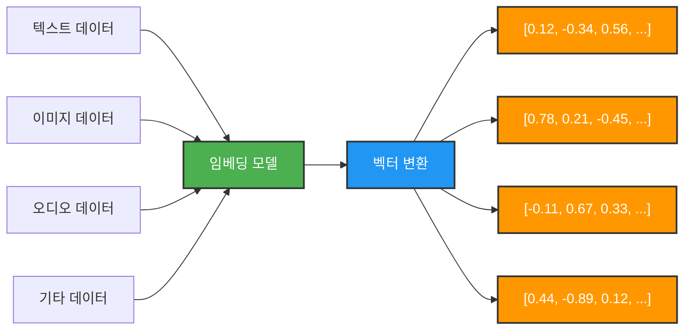

# Chapter 8 임베딩과 벡터 저장소

## 임베딩이란

임베딩은 텍스트나 이미지와 같은 데이터를 부동 소수점 숫자로 이루어진 벡터로 변환하는 과정을 말합니다. 이 작업을 수행하는 모델을 임베딩 모델이라고 합니다.



데이터를 벡터로 변환하는 이유는, 벡터가 방향과 크기를 갖는 다차원 공간의 한 점으로 표현될 수 있기 때문입니다. 이렇게 벡터화된 데이터는 수학적으로 유사도를 계산하기 쉬워집니다. 두 벡터의 방향과 크기가 비슷할수록 해당 데이터 간의 유사도가 높다고 판단할 수 있으며, 반대로 방향과 크기가 다를수록 유사도는 낮다고 볼 수 있습니다. 예를 들어, “강아지”와 “애완견”은 의미적으로 유사한 텍스트로, 이 둘은 임베딩 벡터의 방향과 크기가 서로 비슷합니다.

임베딩 모델은 사전 학습된 데이터를 기반으로 다양한 형태의 입력 데이터를 n차원의 벡터로 변환합니다.

‘n차원’이란 벡터를 구성하는 좌표의 수를 의미합니다. 예를 들어, x축과 y축으로만 표현되는 벡터는 2차원 벡터로, [값, 값] 형태로 나타납니다. 3차원 벡터는 [값, 값, 값]과 같이 세 개의 값을 가지며, 이보다 더 많은 값을 가지는 벡터는 다차원 벡터로 [값, 값, 값, …] 형태로 표현됩니다. 즉, 벡터를 구성하는 값의 개수가 곧 차원을 의미합니다. 임베딩 모델에 따라 텍스트 문장은 구백 또는 수천 찬원의 벡터로 변환될 수 있습니다.

AI 분야에서 임베딩과 벡터 저장소는 밀접한 관계를 가지고 있습니다. 임베딩 모델이 벡터를 출력하면, 벡터 저장소는 이들 벡터들을 저장합니다. 이후, 벡터 저장소에서 제공하는 유사도 검색 기능을 활용해서 쿼리로 제공되는 벡터와 가장 유사한 벡터를 찾을 수 있습니다. 벡터 저장소에서 점들 사이의 거리가 가까울수록 유사도가 높은 벡터를 의미합니다.

예를 들어, 사람의 얼굴 이미지를 벡터화하여 벡터 저장소에 저장해 두었다고 가정했을 때, 사용자의 얼굴 사진을 받아서 벡터로 변환한 뒤, 벡터 저장소에서 유사도 검색을 수행하여, 가장 유사한 얼굴 벡터를 찾을 수 있습니다. 이렇게 찾은 얼굴 벡터와 함께 저장된 사람 이름을 알아내면, 촬영된 사람을 인식할 수 있습니다. 이것을 LLM과 연동하면 LLM은 현재 누구와 대화하고 있는지를 인식하고, 이를 바탕으로 개인화된 응답을 생성할 수도 있습니다.

주의할 점은, 벡터 저장소에 데이터를 저장할 때 사용한 임베딩 모델과 유사도 검색 시 입력 데이터를 벡터화하는 임베딩 모델이 동일해야 합니다. 임베딩 모델마다 사전 학습된 데이터와 임베딩 방식이 다르기 때문에, 동일한 입력 데이터라도 서로 다른 벡터로 임베딩될 수 있습니다. 따라서 서로 다른 모델을 사용할 경우, 벡터 간의 유사도 비교 결과가 부정확해질 수 있습니다.

## 벡터 저장소 설치

벡터 저장소는 벡터 값을 저장하고, 벡터 유사도 검색을 수행하는 특별한 유형의 데이터베이스입니다.

벡터 저장소에서 쿼리는 전통적인 RDB와 다릅니다. 정확한 일치를 찾는 대신 유사도를 계산해서 검색을 수행합니다. 벡터 간의 수치적 거리로 벡터 간의 유사도를 계산하는데, 수치적 거리가 작을수록 유사도가 높고, 수치적 거리가 클수록 유사도가 낮습니다.

벡터 간 수치적 거리를 계산하는 대표적이 방법 두 가지는 L2 거리와 코사인 유사도 기반 거리입니다. L2 거리는 크기가 1인 두 벡터 사이의 거리이고, 코사인 유사도 기반 거리는 두 벡터가 이루는 각도를 이용한 계산 수치입니다.

PostgreSQL을 위한 오픈 소스 확장 기능인 PGvector는 기존 RDBMS 환경에서 벡터를 저장하고 벡터 간의 유사도를  검색할 수 있는 기능을 제공합니다.

PGVector는 vector 컬럼 타입을 이용해 임베딩된 벡터를 관계형 데이터와 함께 저장하고, 인덱싱 및 SQL 쿼리와 같은 기존 PostgreSQL의 기능과 함께 사용할 수 있도록 설계됨.

### PGVector docker-compose (부트캠프 학습 상황에 맞게 재구성)

```yaml
services:
  pgvector-db:
    image: pgvector/pgvector:0.8.2-pg18-trixie
    container_name: pgvector-db
    restart: unless-stopped
    environment:
      POSTGRES_DB: app_vector_db
      POSTGRES_USER: app_user
      POSTGRES_PASSWORD: app_password
    ports:
      - "5432:5432"
    volumes:
      - pgvector_data:/var/lib/postgresql/data
      - ./docker/postgres/init:/docker-entrypoint-initdb.d
    healthcheck:
      test: ["CMD-SHELL", "pg_isready -U app_user -d app_vector_db"]
      interval: 10s
      timeout: 5s
      retries: 10
    networks:
      - app-net

  pgadmin:
    image: dpage/pgadmin4:latest
    container_name: pgadmin
    restart: unless-stopped
    environment:
      PGADMIN_DEFAULT_EMAIL: admin@example.com
      PGADMIN_DEFAULT_PASSWORD: admin1234
      PGADMIN_CONFIG_SERVER_MODE: "False"
    ports:
      - "5050:80"
    depends_on:
      pgvector-db:
        condition: service_healthy
    networks:
      - app-net

volumes:
  pgvector_data:

networks:
  app-net:
```

디렉토리 구조

```text
project-root/
├─ docker-compose.yml
└─ docker/
   └─ postgres/
      └─ init/
         └─ 01-create-extension.sql
```

docker/postgres/init/01-create-extension.sql

```sql
-- docker/postgres/init/01-create-extension.sql

-- 1. 명시적으로 DB 선택
\connect app_vector_db;

-- 2. pgvector extension 생성
CREATE EXTENSION IF NOT EXISTS vector;
CREATE EXTENSION IF NOT EXISTS hstore;
CREATE EXTENSION IF NOT EXISTS "uuid-ossp";
```

application.yml

```yaml
spring:
  datasource:
    url: jdbc:mysql://localhost:3306/app_db
    username: app_user
    password: app_password
    driver-class-name: com.mysql.cj.jdbc.Driver

  jpa:
    hibernate:
      ddl-auto: none
    open-in-view: false

  ai:
    openai:
      api-key: ${OPENAI_API_KEY}
      embedding:
        options:
          model: text-embedding-ada-002  # text-embedding-3-small[large] 

vector:
  datasource:
    url: jdbc:postgresql://localhost:5432/app_vector_db
    username: app_user
    password: app_password
    driver-class-name: org.postgresql.Driver
```

build.gradle

```groovy
// ================================
// DB 드라이버 (MySQL + PostgreSQL)
// ================================
runtimeOnly 'com.mysql:mysql-connector-j'
runtimeOnly 'org.postgresql:postgresql'

// ================================
// Spring AI (pgvector)
// ================================
implementation 'org.springframework.ai:spring-ai-starter-vector-store-pgvector'
implementation 'org.springframework.ai:spring-ai-starter-model-openai'

// RAG용
implementation 'org.springframework.ai:spring-ai-advisors-vector-store'
```

`VectorDataSourceConfig`

```java
@Configuration
public class VectorDataSourceConfig {

    @Bean
    @ConfigurationProperties("vector.datasource")
    public DataSourceProperties vectorDataSourceProperties() {
        return new DataSourceProperties();
    }

    @Bean
    public DataSource vectorDataSource(
            @Qualifier("vectorDataSourceProperties") DataSourceProperties properties
    ) {
        return properties.initializeDataSourceBuilder().build();
    }

    @Bean
    public JdbcTemplate vectorJdbcTemplate(
            DataSource vectorDataSource
    ) {
        return new JdbcTemplate(vectorDataSource);
    }
}
```

`vector.datasource.*` 프로퍼티를 별도 바인딩해서 PostgreSQL 전용 `DataSource`와 `JdbcTemplate`을 만든다. Spring Boot는 이런 식으로 `@ConfigurationProperties`와 `DataSourceProperties`를 사용한 커스텀 DataSource 구성을 공식적으로 지원합니다.

`PgVectorStoreConfig`

```java
@Configuration
public class PgVectorStoreConfig {

    @Bean
    public VectorStore vectorStore(
            JdbcTemplate vectorJdbcTemplate,
            EmbeddingModel embeddingModel
    ) {
        return PgVectorStore.builder(vectorJdbcTemplate, embeddingModel)
                .dimensions(1536)
                .distanceType(COSINE_DISTANCE)
                .indexType(HNSW)
                .initializeSchema(true)
                .build();
    }
}
```

이 builder 형태는 Spring AI 공식 PGVector 문서에 있는 수동 구성 예시 참고. 문서상 기본값은 `distanceType = COSINE_DISTANCE`, `indexType = HNSW`, `vectorTableName = vector_store`, `schemaName = public`, `maxDocumentBatchSize = 10000`이다.

### 서비스 코드 예시

저장

```java
@Service
public class KnowledgeIngestionService {

    private final VectorStore vectorStore;

    public KnowledgeIngestionService(VectorStore vectorStore) {
        this.vectorStore = vectorStore;
    }

    public void save(String content) {
        vectorStore.add(List.of(new Document(content)));
    }
}
```

검색

```java
@Service
public class SemanticSearchService {

    private final VectorStore vectorStore;

    public SemanticSearchService(VectorStore vectorStore) {
        this.vectorStore = vectorStore;
    }

    public List<Document> search(String query) {
        return vectorStore.similaritySearch(
                SearchRequest.builder()
                        .query(query)
                        .topK(5)
                        .build()
        );
    }
}
```

## Spring AI Embedding Model API

### EmbeddingModel 인터페이스

텍스트를 벡터로 변환하는 인터페이스

```java
public interface EmbeddingModel extends Model<EmbeddingRequest, EmbeddingResponse> {

	@Override
	EmbeddingResponse call(EmbeddingRequest request);

	default float[] embed(String text) {
		Assert.notNull(text, "Text must not be null");
		List<float[]> response = this.embed(List.of(text));
		return response.iterator().next();
	}

	float[] embed(Document document);

	default List<float[]> embed(List<String> texts) {
		Assert.notNull(texts, "Texts must not be null");
		return this.call(new EmbeddingRequest(texts, EmbeddingOptions.builder().build()))
			.getResults()
			.stream()
			.map(Embedding::getOutput)
			.toList();
	}

	default List<float[]> embed(List<Document> documents, @Nullable EmbeddingOptions options,
			BatchingStrategy batchingStrategy) {
		Assert.notNull(documents, "Documents must not be null");
		List<float[]> embeddings = new ArrayList<>(documents.size());
		List<List<Document>> batch = batchingStrategy.batch(documents);
		for (List<Document> subBatch : batch) {
			List<String> texts = subBatch.stream().map(Document::getText).toList();
			EmbeddingRequest request = new EmbeddingRequest(texts, options);
			EmbeddingResponse response = this.call(request);
			for (int i = 0; i < subBatch.size(); i++) {
				embeddings.add(response.getResults().get(i).getOutput());
			}
		}
		Assert.isTrue(embeddings.size() == documents.size(),
				"Embeddings must have the same number as that of the documents");
		return embeddings;
	}

	default EmbeddingResponse embedForResponse(List<String> texts) {
		Assert.notNull(texts, "Texts must not be null");
		return this.call(new EmbeddingRequest(texts, EmbeddingOptions.builder().build()));
	}

	default int dimensions() {
		return embed("Test String").length;
	}

}
```

- call() 메소드는 EmbeddingRequest를 매개값으로 받고, EmbeddingResponse를 반환하는 메소드입니다.
- embed() 메소드는 오버로딩 되어있습니다. 임베딩 모델의 입력으로 사용할 단일 텍스트, Document 객체, 텍스트 목록을 매개값으로 받고 임베딩 모델의 출력인 벡터를 반환하는 간편 메소드입니다. 모든 embed() 메소드는 call 메소드를 내부적으로 사용합니다. embed() 메소드는 임베딩 모델에 익숙하지 않은 개발자들이 쉽게 임베딩 결과인 벡터를 얻을 수 있도록 해줍니다.
- embedForResponse() 메소드는 임베딩 모델의 입력으로 사용할 텍스트 목록을 매개값으로 받고, 임베딩 모델의 출력인 벡터와 함께 메타데이터가 포함된 EmbeddingResponse를 반환합니다.
- dimensions() 메소드는 임베딩 벡터의 차원수를 반환

### EmbeddingRequest 클래스

```java
public class EmbeddingRequest implements ModelRequest<List<String>> {
	private final List<String> inputs;
	private final @Nullable EmbeddingOptions options;
}
```

- 임베딩 모델에 입력할 텍스트 목록과 임베딩 모델 옵션을 저장합니다.

### EmbeddingResponse 클래스

```java
public class EmbeddingResponse implements ModelResponse<Embedding> {
	private final List<Embedding> embeddings;
	private final EmbeddingResponseMetadata metadata;
}
```

- 임베딩 모델이 출력한 벡터 목록 (List<Embedding>)과 해당 출력에 대한 메타데이터를 함께 저장합니다.

### Embedding 클래스

```java
public class Embedding implements ModelResult<float[]> {
	private final float[] embedding;
	private final Integer index;
	private final EmbeddingResultMetadata metadata;
}
```

- 단일 텍스트에 대한 임베딩 벡터를 저장하며, List<Embedding> 내에서의 순번과 해당 임베딩 결과에 대한 메타데이터를 함께 포함하고 있습니다.

### EmbeddingResponseMetadata 클래스

```java
public class EmbeddingResponseMetadata extends AbstractResponseMetadata implements ResponseMetadata {

    private String model = "";

    private Usage usage = new EmptyUsage();
}
```

- 임베딩 출력에 대한 메타데이터를 저장하고 있습니다. 메타데이터로는 모델명, Usage(사용된 토큰 정보) 등이 해당됩니다.

## 텍스트 임베딩

```java
@Service
@Slf4j
public class AiService {
  // ##### 필드 #####
  @Autowired
  private EmbeddingModel embeddingModel;

  @Autowired
  private VectorStore vectorStore;

  // ##### 메소드 #####
  public void textEmbedding(String question) {
    // 임베딩하기
    EmbeddingResponse response = embeddingModel.embedForResponse(List.of(question));

    // 임베딩 모델 정보 얻기
    EmbeddingResponseMetadata metadata = response.getMetadata();
    log.info("모델 이름: {}", metadata.getModel());
    log.info("모델의 임베딩 차원: {}", embeddingModel.dimensions());

    // 임베딩 결과 얻기
    Embedding embedding = response.getResults().get(0);
    log.info("벡터 차원: {}", embedding.getOutput().length);
    log.info("벡터: {}", embedding.getOutput());
  }
}
```

- EmbeddingMode의 embedForResponse() 메소드로 사용자 질문을 임베딩합니다. 반환 타입은 EmbeddingResponse입니다. 벡터만 얻고자 한다면 embed()를 사용해도 되지만, 사용된 모델의 이름을 얻기 위해서는 embedForResponse() 메소드를 사용해야 합니다.
- EmbeddingResponse로부터 EmbeddingResponseMetadata 객체를 가져와, 해당 객체에 포함된 모델 이름과 임베딩 벡터의 차원 정보를 출력

## VectorStore 인터페이스

```java
public interface VectorStore extends DocumentWriter {

	default String getName() {
		return this.getClass().getSimpleName();
	}

	void add(List<Document> documents);

	@Override
	default void accept(List<Document> documents) {
		add(documents);
	}

	void delete(List<String> idList);

	void delete(Filter.Expression filterExpression);

	default void delete(String filterExpression) {
		SearchRequest searchRequest = SearchRequest.builder().filterExpression(filterExpression).build();
		Filter.Expression textExpression = searchRequest.getFilterExpression();
		Assert.notNull(textExpression, "Filter expression must not be null");
		this.delete(textExpression);
	}

	@Nullable
	List<Document> similaritySearch(SearchRequest request);

	@Nullable
	default List<Document> similaritySearch(String query) {
		return this.similaritySearch(SearchRequest.builder().query(query).build());
	}
	
	default <T> Optional<T> getNativeClient() {
		return Optional.empty();
	}
}
```

- getName() 메소드는 VectorStore 구현 클래스 이름
- add(List<Document> documents) 메소드는 주어진 Document 목록을 임베딩한 뒤, 각 Document의 임베딩 결과를 벡터 저장소에 저장합니다.
- delete(…) 메소드는 주어진 조건을 이용해서 벡터 저장소에서 Document를 삭제합니다.
- similaritySearch(…) 메소드는 주어진 쿼리를 이용해서 유사도 검색을 수행하고, 유사도가 높은 Document 목록을 반환합니다.
- getNativeClient() 메소드는 VectorStore 구현체가 내부적으로 사용하는 벡터 저장소의 네이티브 클라이언트를 반환합니다. 네이티브 클라이언트가 없는 경우에는 빈 Optional을 반환합니다. 이 메소드는 VectorStore 인터페이스에 정의되지 않은 벡터 저장소의 고유 기능에 접근할 필요가 있을 때 활용할 수 있습니다.

## Document 저장

VectorStore 인터페이스의 add() 메소드는 임베딩할 텍스트를 String 타입으로 받지 않고, Document 타입으로 받고 있습니다. Document는 텍스트 콘텐츠와 메타데이터를 저장하는 컨테이너 역할을 합니다. add() 메소드는 Document 목록을 받고, Document 단위로 임베딩을 수행하고, 그 결과를 벡터 저장소에 하나의 행으로 저장합니다.

```java
public class Document {
	private final String id;
	private final String text;
	private final Media media;
	private final Map<String, Object> metadata;
	@Nullable
	private final Double score;
}
```

- id는  Document를 식별하는 UUID 값입니다. 벡터 저장소에 저장될 때 자동 생성됩니다.
- text는 텍스트 콘텐츠이고, media는 미디어 콘텐츠입니다. Document는 텍스트 콘텐츠 또는 미디어 콘텐츠 중 하나만 저장할 수 있습니다. 두 가지를 동시에 저장할 수 없습니다.
- metadata는 콘텐츠의 메타데이터로 key와 value로 구성된 Map 타입. 조건 검색에서 사용할 수 있는 정보로 활용되는데 콘텐츠의 부가 정보인 출처, 제목, 날짜 등이 저장될 수 있습니다.
- score는 유사도 검색 시 쿼리와의 유사도를 점수로 환산한 값입니다. 값의 범위는 0 ~ 1 사이의 실수입니다. 1에 가까울수록 유사성 또는 관련성이 더 큽니다.

```java
public void addDocument() {
  // Document 목록 생성
  List<Document> documents = List.of(
      new Document("대통령 선거는 5년마다 있습니다.", Map.of("source", "헌법", "year", 1987)),
      new Document("대통령 임기는 4년입니다.", Map.of("source", "헌법", "year", 1980)),
      new Document("국회의원은 법률안을 심의·의결합니다.", Map.of("source", "헌법", "year", 1987)),
      new Document("자동차를 사용하려면 등록을 해야합니다.", Map.of("source", "자동차관리법")),
      new Document("대통령은 행정부의 수반입니다.", Map.of("source", "헌법", "year", 1987)),
      new Document("국회의원은 4년마다 투표로 뽑습니다.", Map.of("source", "헌법", "year", 1987)),
      new Document("승용차는 정규적인 점검이 필요합니다.", Map.of("source", "자동차관리법")));

  // 벡터 저장소에 저장
  vectorStore.add(documents);
}
```

- Document를 생성할 때 텍스트 콘텐츠와 메타데이터를 전달합니다. 메타데이터는 콘텐츠와 관련된 키와 값으로 개수와 상관없이 추가할 수 있습니다.
- VectorStore의 add() 메소드는 주어진 Document 목록에서 Document 단위로 콘텐츠를 임베딩해서 벡터를 생성하고, 텍스트 콘텐츠, 메타데이터와 함께 하나의 행으로 vector_store 테이블에 저장합니다.

## Document 검색

VectorStore 인터페이스의 similaritySearch() 메소드는 주어진 텍스트 또는 SearchRequest를 이용해 벡터 저장소에서 유사한 문서를 검색합니다.

```java
List<Document> similaritySearch(String query);
List<Document> similaritySearch(SearchRequest request);
```

두 메소드 모두 검색 결과로 유사한 Document 목록으로 반환합니다. 텍스트로 검색하면 기본적으로 유사도가 높은 상위 4개의 Document를 가져옵니다. 검색 조건을 지정하고 싶다면 SearchRequest를 매개값으로 제공해야 합니다.

```java
public class SearchRequest {
	public static final double SIMILARITY_THRESHOLD_ACCEPT_ALL = 0.0;
	public static final int DEFAULT_TOP_K = 4;
	private String query = "";
	private int topK = DEFAULT_TOP_K;
	private double similarityThreshold = SIMILARITY_THRESHOLD_ACCEPT_ALL;
	@Nullable
	private Filter.Expression filterExpression;
}
```

- query : 유사도 검색에 사용될 텍스트입니다.
- topK : 유사도가 높은 상위 K개를 지정하는 정수입니다. 기본 값은 4개입니다.
- similarityThreshold : 0에서 1 사이의 double 값으로, 1에 가까울수록 더 높은 유사도를 나타냅니다. 기본 값은 0.0입니다. 예를 들어, 0.75로 설정하면 이 값보다 높은 유사도를 가진 문서들만 검색됩니다.
- Filter.Expression : SQL의 ‘where’ 절과 유사하게 동작하는 표현식으로 메타데이터를 검색 조건으로 합니다.

```java
public List<Document> searchDocument2(String question) {
  List<Document> documents = vectorStore.similaritySearch(
      SearchRequest.builder()
          .query(question)
          .topK(1)
          .similarityThreshold(0.4)
          .filterExpression("source == '헌법' && year >= 1987")
          .build());
  return documents;
}
```

- 메타데이터의 source 값이 ‘헌법’이면서 year 값이 ‘1987’년 이후인 Document 중에서 ‘대통령은 얼마 동안 근무해?’와 유사도가 0.4 이상인 상위 1개의 Document를 가져오도록 검색 조건을 설정했습니다.

Filter.Expression 객체 활용

```java
FilterExpressionBuilder feb = new FilterExpressionBuilder();

.filterExpression(feb
             .and(
                 feb.eq("source", "헌법"),
                 feb.gte("year", 1987)
                 )
             .build()
             )
```

## Document 삭제

VectorStore 인터페이스의 delete() 메소드들은 벡터 저장소에서 Document를 삭제합니다. id 목록으로 삭제할 수도 있고, 메타데이터를 조건으로 해서 삭제할 수도 있습니다.

```java
public void deleteDocument() {
		vectorStore.delete("source == '헌법' && year < 1987");
}
```

- 1987년 이전에 제정된 헌법과 관련된 Document를 삭제합니다.

## 이미지 임베딩

이미지 임베딩 모델에서 사용되는 신경망 아키텍처는 크게 CNN, ViT로 나눌 수 있습니다. CNN은 필터를 이용해 이미지를 슬라이딩하면서 지역적인 특징을 추출하는 데 중점을 둡니다. 반면, ViT는 이미지를 일정 크기의 작은 조각(패치)으로 나눈 뒤, 각 패치들이 전체 이미지 내에서 어떤 관계를 갖는지를 학습하는 데 중점을 둡니다.

예를 들어, CNN은 눈, 코, 귀와 같은 세부 요소를 각각 추출한 후 이를 종합하여 전체 이미지를 인식하는 방식이라면, ViT는 눈이 어디에 있고, 꼬리가 어느 위치에 있는지와 같은 전역적인 구조를 한눈에 파악합니다. 이러한 차이로 인해, CNN은 세부적인 특징을 정밀하게 분석하는 데 유리하며, ViT는 이미지 전체를 조망하여 요소 간의 관계를 파악하는 데 강점이 있습니다.

Spring AI의 Embedding Model API는 텍스트 임베딩만을 지원하고, 이미지 임베딩은 직접적으로 지원하지 않습니다. 따라서 자바 애플리케이션에서 이미지 임베딩을 활용하기 위한 가장 현실적인 방법은, 이미지 임베딩 모델을 Docker 컨테이너로 파이썬 환경에서 실행하고 이를 REST API 형태로 노출한 뒤, 자바 애플리케이션에서 해당 API를 호출하는 방식입니다.

얼굴 인식을 구현한 코드를 확인하기 위해서는 스터디 노션 상단에 제공되어있는 도서 source.zip 파일에서 docker/face-embed-api 와 ch-08-embedding-vector-store를 참고하시면 됩니다. 책에 작성되어있는 자세한 내용은 최종 프로젝트에서 필요한 경우 요청해 주시면 제공해드리겠습니다.